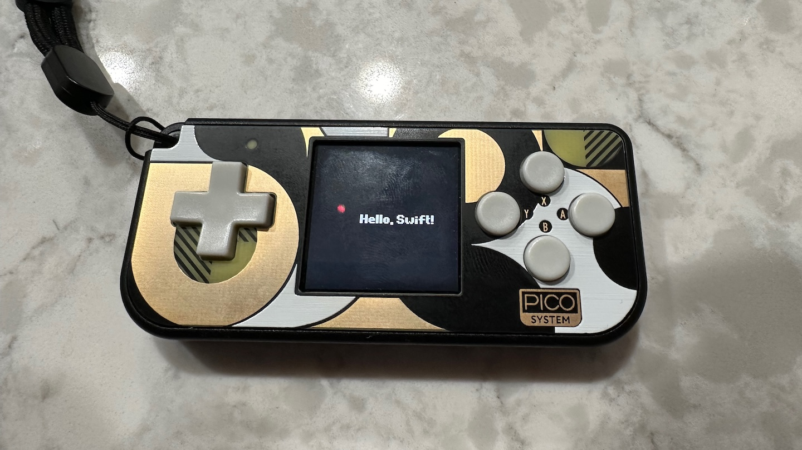

# Embedded Swift on PicoSystem

The [PicoSystem](https://shop.pimoroni.com/products/picosystem) is a small handheld gaming device created by [Pimoroni](https://shop.pimoroni.com) for hobbyists. It is powered by an [RP2040 microcontroller](https://www.raspberrypi.com/products/rp2040/), the same as found on the [Pico boards](https://www.raspberrypi.com/products/raspberry-pi-pico/) from Raspberry Pi.

This example demonstrates a small [Embedded Swift](https://www.swift.org/blog/embedded-swift-examples/) application for the PicoSystem, using the PicoSystem and Pico SDKs via Swift's interop abilities.



## Requirements

- Follow the setup steps at https://datasheets.raspberrypi.com/pico/getting-started-with-pico.pdf. You'll need:
  - A checkout of the [Pico SDK](https://github.com/raspberrypi/pico-sdk.git), with git submodules checked out.
  - CMake.
  - The [Arm Embedded Toolchain](https://developer.arm.com/downloads/-/arm-gnu-toolchain-downloads).
- Follow the steps to set up the PicoSystem SDK at https://github.com/pimoroni/picosystem?tab=readme-ov-file#getting-started.
- Before trying to use Swift with the PicoSystem, make sure your environment works and can build the PicoSystem examples.

## Building

Make sure you have a recent nightly Swift toolchain that has Embedded Swift support.

```console
$ cd swift-picosystem-example
$ export TOOLCHAINS='<toolchain-name>'
$ export PICO_BOARD=pico
$ export PICO_SDK_PATH='<path-to-your-pico-sdk>'
$ export PICO_TOOLCHAIN_PATH='<path-to-the-arm-toolchain>'
$ export PICOSYSTEM_DIR='<path-to-your-picosystem-sdk>'
$ cmake -B build -G Ninja .
$ cmake --build build
```

## Running

- Connect the PicoSystem via a USB cable to your computer.
- Hold down the `X` button on the PicoSystem and press the power button. This will turn the PicoSystem on in the USB Mass Storage firmware upload mode.
- Copy the UF2 firmware to the Mass Storage device:

```console
$ cp build/swift-blinky.uf2 /Volumes/RPI-RP2
```

- The application should begin running on the PicoSystem.

## A Note About the PicoSystem SDK

Due to C++ name mangling differences between Clang and g++, a C layer is used to wrap the PicoSystem SDK calls used in this example. I'm continuing to look into ways to remove this requirement.

## Acknowledgments

Special thanks to Kuba Mracek ([@kubamracek](https://github.com/kubamracek)) and Rauhul Varma ([@rauhul](https://github.com/rauhul)) for their Embedded Swift [examples](https://github.com/apple/swift-embedded-examples.git).